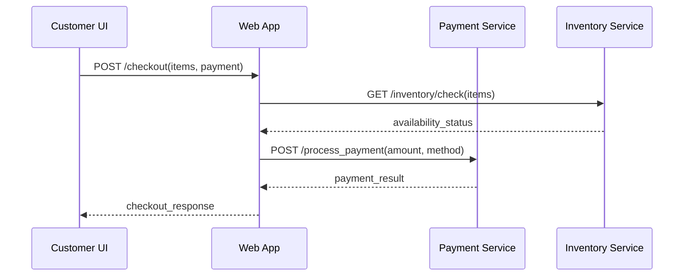

# BDD Specification — Diagramming Interface for a Web Application

A minimal, local-first diagramming app with **auto-rendering workflow**. Focus: **make the canvas feel alive** (move, connect, zoom) and **turn plain Markdown into a rendered flowchart with immediate visual feedback**.

---

## Minimal Canvas (v1)

> **Methodology Header Requirement:** The app must display the current methodology title (e.g., **"BDD"**) **fixed at the top-right** of the canvas viewport at all times.

### Essentials
- **Canvas**: Large finite stage **6000×4000**, white background with **horizontal layout optimization**.
- **Toolbar (left)**: **Select**, **Pan**, **Rectangle**, **Ellipse**, **Diamond**, **Text**, **Line (plain)**, **Connector (arrow)**, **Start**, **End**, **Render Diagram**.
- **Panels**:
  - **Preview panel (right)**: shows parsed summary (nodes/edges), and Mermaid preview when available.
  - **Document Switcher (top-left)**: open files list with methodology badge.
- **Actions (top)**: **Import (.md)**, **Export**, **Undo**, **Redo**, **Delete**.
- **HUD (top-right)**: Methodology tag (e.g., **BDD**).

### Defaults (bigger, readable)
- **Rect** 200×120 (r12) · **Ellipse** 200×130 · **Diamond** 180×180 · **Text** 18px  
- **Stroke** 3px `#111827` · **Fill** `#FFFFFF` · **Selection** `#3B82F6` (3px outline)  
- **Anchors**: N, E, S, W (4 anchors)  
- **Connector**: solid, arrowhead size 10, snap radius 12px with **label support**
- **Line (plain)**: 3px stroke, round caps, draggable endpoints (no auto-attach)

### Interactions (must work)
- **Move**: drag to reposition.  **Resize**: drag corner; **Shift** keeps aspect.  
- **Connect**: Connector tool → drag from anchor→anchor; stays attached on move.  
- **Line**: drag to draw; endpoints draggable; whole line movable.  
- **Pan**: **Space+drag** or middle-mouse.  **Zoom**: **Ctrl+wheel** (50–300%), centered under cursor.  
- **Select**: click, **Shift+click**, **marquee**.  **Delete**: removes shape + attached connectors.  
- **Text edit**: double-click → inline edit → **Enter** save / **Esc** cancel.

### Minimal Shortcuts
**Ctrl+Z / Ctrl+Y** Undo/Redo · **Delete** Remove · **Space+Drag** Pan · **Ctrl+Wheel** Zoom · **Shift+Resize** Keep aspect

---

## Auto-Rendering Workflow — Immediate Visual Feedback

### Core Auto-Rendering Features
- **Automatic rendering**: Diagrams render immediately after successful import without manual "Render" button clicks
- **Loading indicators**: Visual feedback during import and rendering process
- **Success notifications**: Shows element count and confirmation after auto-rendering
- **Fit-to-screen**: Automatically centers and scales imported diagrams for optimal viewing
- **Error handling**: Clear feedback for parsing failures with canvas preservation

### Auto-Rendering Implementation
When you import a markdown file, the application automatically performs these steps in sequence:

1. **Display loading message**: Shows "Importing and auto-rendering diagram..." to keep you informed
2. **Process the file content**: Reads and interprets the markdown structure and converts it to diagram elements
3. **Place elements on canvas**: Positions all shapes and connections according to the horizontal layout rules
4. **Render immediately**: Draws the complete diagram on the canvas without waiting for you to click anything
5. **Fit to screen**: Automatically adjusts zoom and position so you can see the entire diagram clearly
6. **Show confirmation**: Displays a success message telling you exactly how many elements and connections were created

This entire process happens automatically in one smooth workflow, eliminating the need to manually click "Render" after importing.

---

## Horizontal Layout System — Left-to-Right Flow

### Layout Specifications
- **Primary direction**: Left-to-Right (LR) for all flowcharts
- **Coordinate system**: Elements positioned with horizontal progression
- **Spacing**: Minimum 50px horizontal spacing between elements
- **Vertical alignment**: Decision branches use Y-offset positioning
- **Mermaid export**: All flowcharts use `flowchart LR` syntax

### Horizontal Coordinate Mapping
```javascript
// HORIZONTAL LAYOUT: Elements flow from left to right
const startElement = { x: 50, y: 200, width: 120, height: 60 };      // Left start
const submitElement = { x: 220, y: 200, width: 140, height: 60 };    // Next right
const validateElement = { x: 410, y: 200, width: 140, height: 60 };  // Continue right
const decisionElement = { x: 600, y: 180, width: 140, height: 80 };  // Decision point

// VERTICAL BRANCHING: Decision outcomes use Y-offset
const upperBranch = { x: 800, y: 100 };  // Yes path (upper)
const lowerBranch = { x: 800, y: 280 };  // No path (lower)
```

### Benefits of Horizontal Layout
- **Natural reading flow**: Left-to-right matches reading patterns
- **Better screen utilization**: Wider screens accommodate longer processes
- **Clearer decision branches**: Vertical separation for Yes/No paths
- **Improved scalability**: Easier to extend processes horizontally

---

## Import & Render — Markdown with Auto-Processing

### Supported input (any one of these works)
1) **Full MD with Mermaid** (has a ```mermaid``` block).  
2) **Business MD without Mermaid** (e.g., "Employee Expense Reimbursement") that contains:
   - A heading with **Methodology** and **Diagram Type**
   - A **Behavior/Flow** section OR Gherkin **Scenarios**
   - Optional **Parser Hints**
3) **Sequence Diagrams** with participant and message definitions

### Parser rules (plain MD → internal graph)
- Lines starting with **"Step X — Title"** → **node** labeled *Title*.  
- Sections named **Branch …** or **Decision …** → **diamond node**.  
- **"When … Then …"** pairs → **directed edge** from the current step to the next described action/step.  
- **"Outcome → NAME"** → **terminal node** (End state).  
- **SLA/Escalation** notes attach metadata to the **current node**.  
- **Decision branches** automatically get **Yes/No labels** on connections.
- If both **Mermaid** and **plain flow** exist: **Mermaid wins** by default; user can switch to **Rebuild from Flow**.

### Sequence Diagram Parsing
- **Participants**: Extracted from `participants:` section in Diagram Input
- **Messages**: Parsed from `messages:` section with format `- From -> To: Message`
- **Lifelines**: Automatically generated for each participant
- **Message arrows**: Positioned based on participant order and message sequence

---

## Feature: Import Business Input File with Auto-Rendering

**Scenario: Import a plain Markdown file with immediate rendering**  
Given an empty canvas  
And I have a `.md` file without a Mermaid block (e.g., *Employee Expense Reimbursement*)  
When I click **Import (.md)** and select the file  
Then the app parses Methodology, Diagram Type, and Flow/Scenarios  
And shows a **Preview panel** with the detected nodes/edges count  
And **automatically renders the diagram immediately** on the canvas without manual intervention  
And displays a **loading indicator** with message "Importing and auto-rendering diagram..."  
And **fits the diagram to screen** for optimal viewing with horizontal layout  
And shows a **success notification** with exact element count: "Diagram auto-rendered successfully - X elements, Y connections"  
And the **Render Diagram button becomes optional** for re-rendering only

**Scenario: Import a Markdown file that already has Mermaid with auto-rendering**  
Given a `.md` with a Mermaid block  
When I import it  
Then the diagram **renders immediately** on the **canvas (center area)** with horizontal layout  
And the **Preview panel** shows the Mermaid source (read-only)  
And the Document Switcher lists the file with a methodology badge  
And **auto-fit to screen** centers the imported content

**Scenario: Import sequence diagram with auto-rendering**  
Given a `.md` file with sequence diagram structure  
When I import it  
Then participants are **automatically positioned horizontally** with 150px spacing  
And lifelines are **generated vertically** for each participant  
And messages are **positioned chronologically** from top to bottom  
And the diagram **auto-renders immediately** with proper sequence layout

**Scenario: Invalid or missing sections**  
Given I import a `.md` without any Flow/Scenarios and without Mermaid  
When the app validates the file  
Then it shows **"File missing diagram content"**  
And the canvas remains unchanged  
And **no auto-rendering occurs**

**Scenario: Header consistency with auto-update**  
Given the header shows "BDD"  
When I import a file with Methodology "DDD"  
Then the header **automatically updates** to "DDD"  
And the diagram **auto-renders** with the new methodology context

---

## Feature: Enhanced Export System — Multiple Formats with Diagram Type Detection

> The **Export** button opens a menu with **five options**:  
> **Export → Mermaid (.md)** · **Human-readable (.md)** · **PNG (image)** · **SVG (vector)** · **JSON (data)**

**Scenario: Export as Mermaid (.md) with horizontal layout**  
Given a diagram is visible on the canvas  
When I choose **Export → Mermaid (.md)**  
Then the app generates a Markdown file that contains:  
- **Front-matter**: Methodology, Diagram Type, Title  
- A single ```mermaid``` **Diagram Input** block with **`flowchart LR`** (horizontal layout)  
- **Yes/No labels** on decision branch connections: `D -->|Yes| H` and `D -->|No| E`  
- **Comment headers** with flow title and primary outcomes  
And the file downloads as `title-kebab-case-mermaid.md`

**Scenario: Export as Human-readable (.md) with diagram type detection**  
Given a **flowchart** diagram is visible  
When I choose **Export → Human-readable (.md)**  
Then the app **detects diagram type** and generates:  
- **Front-matter**: Methodology, Diagram Type, Title  
- **Behavior Flow section** with step-by-step breakdown  
- **Decision points** with branching logic  
- **Outcomes section** listing all terminal states  
And the file downloads as `title-kebab-case-readable.md`

**Scenario: Export sequence diagram as Human-readable (.md)**  
Given a **sequence** diagram is visible  
When I choose **Export → Human-readable (.md)**  
Then the app generates **sequence-specific documentation**:  
- **Participants section**: Lists all actors with descriptions  
- **Message Flow section**: Step-by-step message exchanges with Given/When/Then format  
- **Interaction Summary**: Overview of participant interactions  
- **Business Rules**: Process validation and requirements  
And the content reflects the **actual sequence structure** from the canvas

**Scenario: Export as PNG with proper framing**  
Given a diagram is visible  
When I choose **Export → PNG (image)**  
Then the app exports a PNG of the **current canvas content** with:  
- **Automatic bounds calculation** around all elements  
- **50px padding** around the diagram  
- **Configurable scale** (1x, 2x, 3x) for resolution  
- **Background options** (white, transparent)  
- **Proper element and connection rendering** matching canvas display

**Scenario: Export as SVG (vector graphics)**  
Given a diagram is visible  
When I choose **Export → SVG (vector)**  
Then the app generates **scalable vector graphics** with:  
- **XML-compliant SVG structure** with proper namespaces  
- **Vector shapes** for all elements (rectangles, diamonds, circles)  
- **Vector paths** for all connections with arrow heads  
- **Text elements** with proper positioning and styling  
- **Infinite scalability** without quality loss

**Scenario: Export reflects current canvas state (round-trip)**  
Given I imported a plain `.md` (no Mermaid), auto-rendered it, and made manual edits  
When I **Export → Mermaid (.md)**  
Then the Mermaid generated **represents the current canvas state** including manual modifications  
And re-importing that exported file **recreates the exact same diagram** with horizontal layout  
And **Yes/No labels** are preserved on decision branches

**Scenario: Export menu availability**  
Given the canvas is empty  
When I open **Export**  
Then options are disabled and a tooltip reads **"Render or draw a diagram first"**  
Given a diagram exists on canvas  
When I open **Export**  
Then all format options are **enabled and functional**

---

## Feature: Decision Branch Labeling — Yes/No Path Clarity

### Label Implementation
- **Automatic labeling**: Decision branches get Yes/No labels based on the flow logic
- **Visual display**: Labels appear at the middle of connection lines using clear, readable text
- **Export preservation**: Labels are maintained in both Mermaid and human-readable exports
- **Smart labeling**: The system automatically determines which path should be labeled "Yes" and which should be "No"

### Label Specifications
When you have decision points in your diagram, the connections automatically get labeled:

- **Yes path**: The approval or positive outcome route gets a "Yes" label
- **No path**: The rejection or negative outcome route gets a "No" label
- **Nested decisions**: Multiple decision points each get their own Yes/No labels
- **Visual clarity**: Labels help users understand which path represents which decision outcome

For example, in an expense reimbursement process:
- "Validation Passed?" → "Yes" leads to Manager Review
- "Validation Passed?" → "No" leads to Receipt Decision
- "Missing Receipt?" → "Yes" leads to Needs Receipt outcome
- "Missing Receipt?" → "No" leads to Rejected outcome

**Scenario: Decision branch auto-labeling**  
Given a flowchart with decision nodes  
When the diagram is rendered  
Then **Yes/No labels** appear automatically on decision branch connections  
And labels are **positioned at connection midpoints**  
And labels use **consistent styling** (12px Arial, #333333 color)

**Scenario: Label preservation in exports**  
Given a diagram with labeled decision branches  
When I export as **Mermaid (.md)**  
Then the exported mermaid includes **`|Yes|` and `|No|` syntax** on appropriate connections  
When I export as **Human-readable (.md)**  
Then the documentation **describes the decision logic** with clear branching explanations

---

## Feature: Sequence Diagram Support — Full Implementation

### Sequence Diagram Capabilities
- **Participant management**: Automatic participant extraction and positioning
- **Lifeline generation**: Vertical lifelines for each participant with multiple connection points
- **Message flow**: Chronological message positioning with proper arrow directions
- **Export formats**: Both Mermaid sequence syntax and rich human-readable documentation

### Sequence Layout System
```javascript
// Participant positioning (horizontal spacing)
participantX = 100 + (participantIndex * 150);
participantY = 50;

// Lifeline positioning (vertical extension)
lifelineX = participantX + 59; // Center under participant
lifelineY = 90;
lifelineHeight = 500;

// Message positioning (chronological flow)
messageY = 150 + (messageIndex * 45); // Top to bottom
```

**Scenario: Import sequence diagram with auto-rendering**  
Given a `.md` file with sequence diagram structure containing participants and messages  
When I import the file  
Then participants are **positioned horizontally** with 150px spacing  
And **lifelines are generated automatically** extending 500px vertically  
And messages are **positioned chronologically** from top to bottom  
And the diagram **auto-renders immediately** without manual intervention  
And **fit-to-screen** optimizes the sequence view

**Scenario: Sequence diagram export as Mermaid**  
Given a sequence diagram on canvas  
When I export as **Mermaid (.md)**  
Then the output uses **`sequenceDiagram`** syntax  
And includes **participant declarations**: `participant A as Customer UI`  
And includes **message arrows**: `A->>B: POST /checkout(...)`  
And preserves **message order** and **participant relationships**

**Scenario: Sequence diagram export as Human-readable**  
Given a sequence diagram on canvas  
When I export as **Human-readable (.md)**  
Then the output includes:  
- **Participants section**: Lists all actors with descriptions  
- **Message Flow section**: Step-by-step exchanges with Given/When/Then format  
- **Interaction Summary**: Overview of the communication pattern  
- **Business Rules**: Process validation and interaction requirements

---

## Feature: Import Business Input File with Auto-Rendering

**Scenario: Import with immediate visual feedback**  
Given an empty canvas  
And I have a `.md` file (flowchart or sequence)  
When I click **Import (.md)** and select the file  
Then the app **immediately shows loading indicator** with descriptive message  
And parses Methodology, Diagram Type, and content structure  
And **automatically renders the diagram** without waiting for manual render  
And **fits diagram to screen** with optimal zoom and centering  
And shows **success notification** with exact counts: "Diagram auto-rendered successfully - X elements, Y connections"  
And the **Preview panel updates** with parsed summary

**Scenario: Auto-rendering failure handling**  
Given I import a `.md` with parsing errors  
When the auto-rendering process encounters issues  
Then the **loading indicator disappears**  
And an **error message** specifies the parsing problem  
And the **canvas remains unchanged** (no corruption)  
And I can **retry with corrected input**

---

## Feature: Render Diagram (manual override and re-rendering)

**Scenario: Manual re-render of existing diagram**  
Given a diagram is already on the canvas  
When I click **Render Diagram**  
Then the app **re-renders the current elements** with updated positioning  
And shows **success notification**: "Diagram re-rendered - X elements"  
And **auto-fits to screen** with current zoom preserved

**Scenario: Rebuild from Flow (override Mermaid)**  
Given a file contains both Mermaid and Flow text  
When I choose **Rebuild from Flow**  
Then the app ignores the Mermaid block  
And constructs the diagram from the Flow text with **horizontal layout**  
And **auto-renders immediately** with the new structure

**Scenario: Render with no data**  
Given the canvas is empty and no pending import exists  
When I click **Render Diagram**  
Then I see **"No data to render. Please import markdown first using the Import MD button."**  
And the canvas remains unchanged

---

## Feature: Display Rendered Diagram with Horizontal Optimization

**Scenario: Canvas placement with horizontal layout**  
Given a diagram is rendered with horizontal flow  
When the render completes  
Then the diagram is **centered on the main canvas** with left-to-right orientation  
And a **breadcrumbs bar** above the canvas shows *File Title • Methodology • Diagram Type*  
And **zoom controls** (±, 100%, Fit) are visible and functional  
And **horizontal scrolling** is available for wide diagrams

**Scenario: Fit and zoom behavior for horizontal layouts**  
Given a wide horizontal diagram  
When auto-rendering finishes  
Then the view sets to **Fit to Screen** with proper aspect ratio  
And the user can zoom between **50–300%** while maintaining center focus  
And **horizontal panning** works smoothly for navigation

**Scenario: Decision branch visualization**  
Given a flowchart with decision nodes  
When the diagram renders  
Then decision branches are **clearly separated vertically**  
And **Yes/No labels** are visible at connection midpoints  
And **branch paths** are visually distinct with proper spacing

---

## Feature: Enhanced Export System — Format-Specific Generation

### Export Format Specifications

#### Mermaid Export (.md)
```mermaid
flowchart LR
  %% Flow Title: Employee Expense Reimbursement
  %% Primary Outcomes: Paid (Scheduled), Rejected, Needs Receipt

  A([Start]) --> B[Submit Claim]
  B --> C[Validate Claim]
  C --> D{Validation Passed?}
  D -->|Yes| H[Manager Review]
  D -->|No| E{Missing Receipt & Amount ≥ $50?}
  E -->|Yes| F([Needs Receipt])
  E -->|No| G([Rejected])
  H --> I{Approved?}
  I -->|Yes| J[Schedule Payment]
  I -->|No| G
  J --> Z([Paid (Scheduled)])
```

#### Human-Readable Export (.md)
- **Flowchart format**: Step-by-step breakdown with Given/When/Then structure
- **Sequence format**: Participant interactions with message flow documentation
- **Decision documentation**: Clear explanation of branching logic
- **Outcome mapping**: Terminal states with business context

#### Image Export (PNG/SVG)
- **Bounds calculation**: Automatic sizing around all elements with 50px padding
- **Scale options**: 1x, 2x, 3x resolution for PNG
- **Background options**: White or transparent
- **Vector precision**: SVG maintains infinite scalability

**Scenario: Export format detection and generation**  
Given a **flowchart** diagram on canvas  
When I export in any format  
Then the system **detects diagram type** automatically  
And generates **format-appropriate content** (flowchart vs sequence)  
And preserves **horizontal layout** in Mermaid exports  
And includes **Yes/No labels** in connection syntax

**Scenario: Sequence export with rich documentation**  
Given a **sequence** diagram on canvas  
When I export as **Human-readable (.md)**  
Then the output includes:  
- **Participants section**: `- **Customer UI**: System actor in the interaction`  
- **Message Flow section**: `**Step 1**: Customer UI → Web App` with Given/When/Then format  
- **Interaction Summary**: Process overview with participant count and message count  
- **Business Rules**: Validation requirements and process constraints

---

## Feature: Connection Management with Labeling

### Connection Types and Labels
- **Standard connections**: Unlabeled arrows for sequential flow
- **Decision connections**: Labeled with Yes/No for branching logic
- **Message connections**: Labeled with message content for sequences
- **Timer connections**: Dashed lines for SLA escalations

### Connection Implementation
The application creates different types of connections based on the diagram flow:

- **Standard connections**: Simple arrows that connect one step to the next in sequence
- **Labeled connections**: Decision branch arrows that display "Yes" or "No" to show which path represents which choice
- **Connection positioning**: Labels appear at the middle point of each connection line for clear visibility
- **Automatic detection**: The system determines when labels are needed based on whether the connection comes from a decision point

When you create a flowchart with decision points, the application automatically adds appropriate labels to help users understand the flow logic.

**Scenario: Automatic decision branch labeling**  
Given a decision node with multiple outgoing connections  
When the diagram renders  
Then **approval paths** get **"Yes"** labels automatically  
And **rejection paths** get **"No"** labels automatically  
And labels are **positioned at connection midpoints**  
And labels use **consistent styling** across all connections

---

## Feature: UI Header with Dynamic Updates

**Scenario: Display methodology with auto-updates**  
Given I am viewing the application  
When the methodology is **BDD**  
Then the title **BDD** appears at the top-right, clearly styled  
When I import a file with different methodology (e.g., **DDD**)  
Then the header **automatically updates** to show **DDD**  
And the change is **immediate** without page refresh

**Scenario: Persist header during operations**  
Given a file is open with auto-rendered diagram  
When I zoom, pan, edit, or export  
Then the header remains visible and shows **current methodology**  
And header updates reflect **active document context**

---

## Feature: Error Handling & Edge Cases with Auto-Rendering

**Scenario: Auto-rendering with large datasets**  
Given a file that would create > 100 elements  
When I import it  
Then a **progress indicator** shows during auto-rendering  
And the app remains **responsive** throughout the process  
And **auto-fit to screen** handles large diagrams appropriately

**Scenario: Import with conflicting sections and auto-processing**  
Given a file has Mermaid and Flow that disagree  
When I import it  
Then the app **auto-renders from Mermaid** by default  
And shows a **"Sections out of sync"** notice  
And provides **Rebuild from Flow** action for alternative rendering  
And **both options auto-render** when selected

**Scenario: Auto-rendering failure recovery**  
Given an import that fails during auto-rendering  
When the parsing encounters errors  
Then the **loading indicator disappears immediately**  
And a **specific error message** explains the failure  
And the **canvas state is preserved** (no corruption)  
And I can **import different content** without restart

---

## Technical Implementation Details

### Auto-Rendering Pipeline
1. **File validation**: Check for required sections and format
2. **Metadata extraction**: Parse methodology, diagram type, and title
3. **Content parsing**: Extract elements and connections based on type
4. **Element positioning**: Apply horizontal layout with proper spacing
5. **Connection labeling**: Add Yes/No labels to decision branches
6. **Immediate rendering**: Render to canvas without manual intervention
7. **Auto-fit display**: Center and scale for optimal viewing
8. **Success feedback**: Show notification with element counts

### Horizontal Layout Coordinate System
- **X-axis progression**: Elements advance left-to-right with 170-190px spacing
- **Y-axis branching**: Decision outcomes use vertical offset (±100px from main flow)
- **Connection anchors**: 4-point system (N, E, S, W) for flexible connections
- **Fit-to-screen**: Automatic bounds calculation with 50px padding

### Export Generation Logic
- **Diagram type detection**: Automatic identification of flowchart vs sequence
- **Format-specific generation**: Separate functions for each export type
- **Content preservation**: Round-trip compatibility for all formats
- **Label inclusion**: Yes/No labels preserved in Mermaid syntax

---

## Acceptance Criteria — Complete Feature Coverage
- ✅ **Auto-rendering**: Imports trigger immediate diagram rendering without manual steps
- ✅ **Horizontal layout**: All flowcharts use left-to-right orientation with proper spacing
- ✅ **Decision labeling**: Yes/No labels appear automatically on decision branches
- ✅ **Sequence support**: Full sequence diagram parsing, rendering, and export
- ✅ **Enhanced exports**: Five format options with diagram-type-specific generation
- ✅ **Loading feedback**: Visual indicators during import and rendering operations
- ✅ **Success notifications**: Element count confirmation after operations
- ✅ **Error handling**: Graceful failure with specific error messages
- ✅ **Round-trip compatibility**: Exported files re-import to identical diagrams
- ✅ **Fit-to-screen**: Automatic centering and scaling for optimal viewing

---

## Example — Generated Mermaid with Horizontal Layout and Labels
```mermaid
flowchart LR
  %% Flow Title: Employee Expense Reimbursement
  %% Primary Outcomes: Paid (Scheduled), Rejected, Needs Receipt

  A([Start]) --> B[Submit Claim]
  B --> C[Validate Claim]
  C --> D{Validation Passed?}
  
  D -->|No| E{Missing Receipt & Amount ≥ $50?}
  E -->|Yes| F([Needs Receipt])
  E -->|No| G([Rejected])
  
  D -->|Yes| H[Manager Review]
  H --> I{Approved?}
  I -->|Yes| J[Schedule Payment ≤ 5 business days]
  I -->|No| G
  J --> Z([Paid (Scheduled)])
```

---

## Example — Sequence Diagram Export Structure

